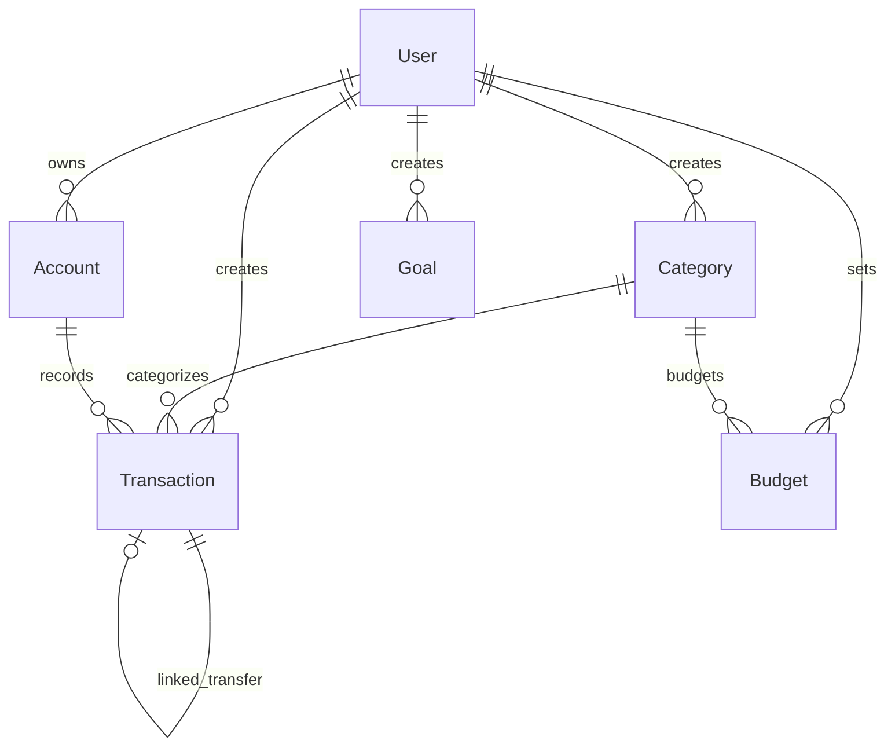

# Database Guidelines - Anti-Gravity Money Manager

> **Tech Stack**: MongoDB Atlas + Mongoose 9
> **Related Docs**: [FRONTEND.md](./FRONTEND.md) | [BACKEND.md](./BACKEND.md) | [Root AGENTS.md](../AGENTS.md)

---

## Entity Relationship Diagram



---

## Collections Overview

| Collection | Soft Delete | Indexes | Purpose |
|------------|-------------|---------|---------|
| User | No | email (unique) | Authentication |
| Transaction | Yes | 5 compound | Financial records |
| Category | Yes | 2 compound | Income/expense categories |
| Account | Yes | 1 compound | Bank/cash/wallet accounts |
| Budget | No | 2 (1 unique) | Monthly spending limits |
| Goal | Yes | 1 compound | Savings targets |

---

## Schema Definitions

### User
```javascript
{
    email: { type: String, required: true, unique: true, lowercase: true },
    password: { type: String, required: true, select: false },  // Excluded from queries
    name: { type: String, required: true, maxLength: 50 },
    createdAt: { type: Date, default: Date.now }
}
// Index: email (unique)
```

### Transaction
```javascript
{
    userId: { type: ObjectId, ref: 'User', required: true },
    type: { type: String, enum: ['income', 'expense', 'transfer'], required: true },
    amount: { type: Number, required: true, min: 0 },
    categoryId: { type: ObjectId, ref: 'Category', required: true },
    description: { type: String, maxLength: 200, default: '' },
    date: { type: Date, required: true },
    division: { type: String, enum: ['personal', 'office'], required: true },
    accountId: { type: ObjectId, ref: 'Account', default: null },
    linkedTransactionId: { type: ObjectId, ref: 'Transaction', default: null },  // For transfers
    isDeleted: { type: Boolean, default: false },
    deletedAt: { type: Date, default: null },
    createdAt: Date,  // timestamps: true
    updatedAt: Date
}
// Indexes: (userId, date), (userId, isDeleted), (userId, categoryId), (userId, type), (userId, division)
```

### Category
```javascript
{
    name: { type: String, required: true, maxLength: 50 },
    emoji: { type: String, required: true, maxLength: 4 },
    type: { type: String, enum: ['income', 'expense'], required: true },
    division: { type: String, enum: ['personal', 'office'], required: true },
    isDefault: { type: Boolean, default: false },  // System categories
    userId: { type: ObjectId, ref: 'User', default: null },  // null for defaults
    isDeleted: { type: Boolean, default: false },
    createdAt: { type: Date, default: Date.now }
}
// Indexes: (userId, isDeleted), (isDefault)
```

### Account
```javascript
{
    userId: { type: ObjectId, ref: 'User', required: true },
    name: { type: String, required: true, maxLength: 50 },
    type: { type: String, enum: ['bank', 'cash', 'wallet'], required: true },
    balance: { type: Number, default: 0 },
    isDeleted: { type: Boolean, default: false },
    createdAt: { type: Date, default: Date.now }
}
// Index: (userId, isDeleted)
```

### Budget
```javascript
{
    userId: { type: ObjectId, ref: 'User', required: true },
    categoryId: { type: ObjectId, ref: 'Category', required: true },
    amount: { type: Number, required: true, min: 0 },
    period: { type: String, enum: ['monthly', 'weekly'], default: 'monthly' },
    createdAt: Date,
    updatedAt: Date
}
// Indexes: (userId), (userId, categoryId) UNIQUE
```

### Goal
```javascript
{
    userId: { type: ObjectId, ref: 'User', required: true },
    name: { type: String, required: true, maxLength: 100 },
    targetAmount: { type: Number, required: true, min: 0 },
    currentAmount: { type: Number, default: 0, min: 0 },
    targetDate: { type: Date, required: true },
    isCompleted: { type: Boolean, default: false },
    isDeleted: { type: Boolean, default: false },
    createdAt: Date,
    updatedAt: Date
}
// Index: (userId, isDeleted)
```

---

## Validation Layers

### Layer 1: Zod (API Level) - See [BACKEND.md](./BACKEND.md)
- Validates request body before reaching database
- Provides user-friendly error messages
- Transforms data (defaults, type coercion)

### Layer 2: Mongoose (Database Level)
- Final validation before save
- Enforces schema constraints
- Handles type casting

```javascript
// Both layers should be consistent:
// Zod: amount: z.number().positive()
// Mongoose: amount: { type: Number, min: 0 }

// Note: Mongoose allows 0 (min: 0), Zod requires positive
// FIX: Change Mongoose to min: 0.01 or Zod to min(0)
```

---

## Index Strategy

### When to Add Indexes
| Query Pattern | Index Needed |
|---------------|--------------|
| `find({ userId, isDeleted })` | Compound: `(userId, isDeleted)` |
| `find({ userId }).sort({ date: -1 })` | Compound: `(userId, date)` |
| Filter by category | Compound: `(userId, categoryId)` |
| Unique constraint | Unique index |
| Text search | Text index (consider) |

### Current Indexes

**Transaction** (most queried):
```javascript
{ userId: 1, date: -1 }      // Dashboard, sorted lists
{ userId: 1, isDeleted: 1 }  // All queries filter deleted
{ userId: 1, categoryId: 1 } // Category filtering
{ userId: 1, type: 1 }       // Income vs expense
{ userId: 1, division: 1 }   // Personal vs office
```

### Missing Index (Recommended)
```javascript
// For budget spending calculation - add to Transaction
{ userId: 1, categoryId: 1, date: 1, type: 1, isDeleted: 1 }
```

---

## Soft Delete Pattern

### Implementation
```javascript
// Schema fields
{
    isDeleted: { type: Boolean, default: false },
    deletedAt: { type: Date, default: null }
}

// Delete operation
await Model.findByIdAndUpdate(id, {
    isDeleted: true,
    deletedAt: new Date()
});

// All queries MUST filter
Model.find({ userId, isDeleted: false });

// Restore (undo) - within 30 seconds
await Model.findByIdAndUpdate(id, {
    isDeleted: false,
    deletedAt: null
});
```

### Applied To
- Transaction, Category, Account, Goal

### NOT Applied To
- Budget (hard delete - settings, not content)
- User (not deletable)

---

## Virtuals

### Transaction.canEdit
```javascript
transactionSchema.virtual('canEdit').get(function() {
    const hoursElapsed = (Date.now() - this.createdAt) / (1000 * 60 * 60);
    return hoursElapsed < 12;
});

// Enable in JSON output
transactionSchema.set('toJSON', { virtuals: true });
```

### Goal.progress (Recommended)
```javascript
goalSchema.virtual('progress').get(function() {
    return this.targetAmount > 0 
        ? Math.min(100, (this.currentAmount / this.targetAmount) * 100)
        : 0;
});
```

---

## Aggregation Patterns (Optimized)

### Transaction Summary
```javascript
// GET /transactions/summary
const summary = await Transaction.aggregate([
    { $match: { userId: ObjectId(userId), isDeleted: false, date: { $gte: startDate, $lte: endDate } } },
    { $group: { _id: '$type', total: { $sum: '$amount' } } }
]);
// Returns: [{ _id: 'income', total: 50000 }, { _id: 'expense', total: 32000 }]
```

### Budget Spending (FIXED - was N+1)
```javascript
// OLD (N+1 problem):
for (const budget of budgets) {
    const spent = await Transaction.aggregate([...]); // N queries!
}

// NEW (single query):
const spending = await Transaction.aggregate([
    { $match: { 
        userId: ObjectId(userId), 
        isDeleted: false, 
        type: 'expense',
        date: { $gte: startOfMonth, $lte: endOfMonth }
    }},
    { $group: { _id: '$categoryId', spent: { $sum: '$amount' } } }
]);

// Then join in JavaScript
const budgetsWithSpending = budgets.map(budget => ({
    ...budget,
    spent: spending.find(s => s._id.equals(budget.categoryId))?.spent || 0
}));
```

### Category Breakdown (for charts)
```javascript
const breakdown = await Transaction.aggregate([
    { $match: { userId: ObjectId(userId), isDeleted: false, type: 'expense', date: { $gte: start, $lte: end } } },
    { $group: { _id: '$categoryId', total: { $sum: '$amount' }, count: { $sum: 1 } } },
    { $lookup: { from: 'categories', localField: '_id', foreignField: '_id', as: 'category' } },
    { $unwind: '$category' },
    { $project: { name: '$category.name', emoji: '$category.emoji', total: 1, count: 1 } },
    { $sort: { total: -1 } }
]);
```

### Daily Trend (for line chart)
```javascript
const trend = await Transaction.aggregate([
    { $match: { userId: ObjectId(userId), isDeleted: false, date: { $gte: start, $lte: end } } },
    { $group: {
        _id: { $dateToString: { format: '%Y-%m-%d', date: '$date' } },
        income: { $sum: { $cond: [{ $eq: ['$type', 'income'] }, '$amount', 0] } },
        expense: { $sum: { $cond: [{ $eq: ['$type', 'expense'] }, '$amount', 0] } }
    }},
    { $sort: { _id: 1 } },
    { $project: { date: '$_id', income: 1, expense: 1, net: { $subtract: ['$income', '$expense'] } } }
]);
```

### Insights Spending by Category (FIXED - was N+1)
```javascript
// Single aggregation for all budget categories
const allSpending = await Transaction.aggregate([
    { $match: { 
        userId: ObjectId(userId),
        type: 'expense',
        isDeleted: false,
        date: { $gte: startOfMonth, $lte: endOfMonth }
    }},
    { $group: { _id: '$categoryId', spent: { $sum: '$amount' } } }
]);

// Create lookup map
const spendingMap = new Map(allSpending.map(s => [s._id.toString(), s.spent]));

// Use map for each budget
budgets.forEach(budget => {
    budget.spent = spendingMap.get(budget.categoryId.toString()) || 0;
});
```

---

## Common Query Patterns

```javascript
// Active items for user
Model.find({ userId, isDeleted: false });

// Paginated list
Model.find({ userId, isDeleted: false })
    .sort({ date: -1 })
    .skip((page - 1) * limit)
    .limit(limit);

// With population
Transaction.find({ userId, isDeleted: false })
    .populate('categoryId', 'name emoji type')
    .populate('accountId', 'name type');

// Date range filter
Transaction.find({
    userId,
    isDeleted: false,
    date: { $gte: new Date(startDate), $lte: new Date(endDate) }
});

// Text search on description
Transaction.find({
    userId,
    isDeleted: false,
    description: { $regex: searchTerm, $options: 'i' }
});
```

---

## Migration Strategy

### Current Approach
Manual migrations via MongoDB shell or Compass:
```javascript
// Example: Add new field to all transactions
db.transactions.updateMany({}, { $set: { newField: defaultValue } });
```

### For Future Consideration
- `migrate-mongo` package for versioned migrations
- Migration scripts in `backend/migrations/`

---

## Cross-References

- **Zod Schemas**: See [BACKEND.md](./BACKEND.md) for API-level validation
- **Store Usage**: See [FRONTEND.md](./FRONTEND.md) for how data is consumed
- **Detailed Architecture**: See `docs/database-design.md` for full documentation
