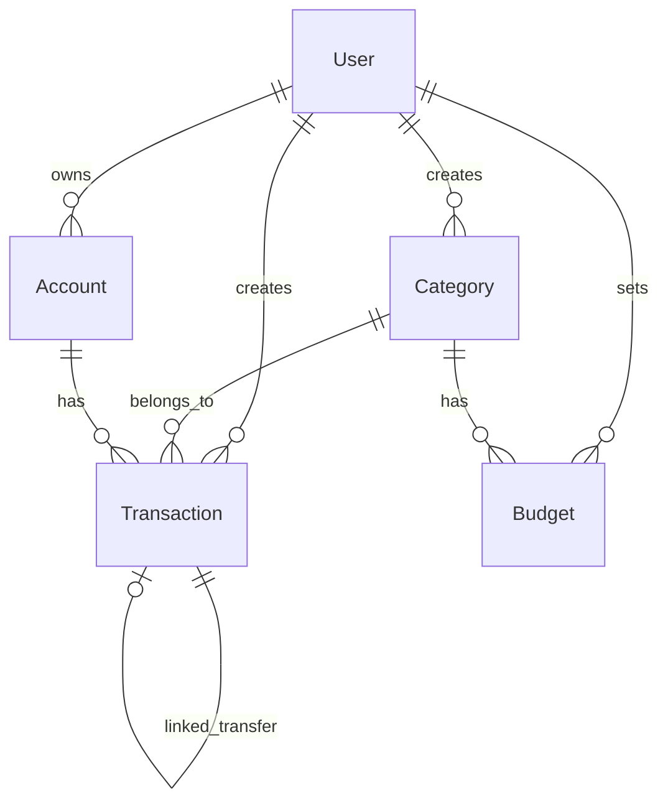

# Database Design
## Money Manager Web Application

---

## 1. Database Overview

| Property | Value |
|----------|-------|
| Database | MongoDB Atlas (Free Tier) |
| ODM | Mongoose 8.x |
| Collections | 5 |
| Soft Delete | Transactions, Categories, Accounts |
| Indexes | Strategic for query performance |

---

## 2. Collections



---

## 3. User Collection

### Schema
```javascript
{
  _id: ObjectId,
  email: {
    type: String,
    required: true,
    unique: true,
    lowercase: true,
    trim: true
  },
  password: {
    type: String,
    required: true,
    select: false  // Not returned by default
  },
  name: {
    type: String,
    required: true,
    trim: true,
    maxLength: 50
  },
  createdAt: {
    type: Date,
    default: Date.now
  }
}
```

### Indexes
| Index | Fields | Type |
|-------|--------|------|
| email_unique | email | Unique |

### Sample Document
```json
{
  "_id": "65a1b2c3d4e5f6a7b8c9d0e1",
  "email": "john@example.com",
  "password": "$2a$10$...(hashed)",
  "name": "John Doe",
  "createdAt": "2026-02-01T10:00:00.000Z"
}
```

---

## 4. Transaction Collection

### Schema
```javascript
{
  _id: ObjectId,
  userId: {
    type: ObjectId,
    ref: 'User',
    required: true,
    index: true
  },
  type: {
    type: String,
    enum: ['income', 'expense', 'transfer'],
    required: true
  },
  amount: {
    type: Number,
    required: true,
    min: 0
  },
  categoryId: {
    type: ObjectId,
    ref: 'Category',
    required: true
  },
  description: {
    type: String,
    trim: true,
    maxLength: 200,
    default: ''
  },
  date: {
    type: Date,
    required: true,
    index: true
  },
  division: {
    type: String,
    enum: ['personal', 'office'],
    required: true
  },
  accountId: {
    type: ObjectId,
    ref: 'Account',
    default: null
  },
  linkedTransactionId: {
    type: ObjectId,
    ref: 'Transaction',
    default: null  // For transfers only
  },
  isDeleted: {
    type: Boolean,
    default: false
  },
  deletedAt: {
    type: Date,
    default: null
  },
  createdAt: {
    type: Date,
    default: Date.now
  },
  updatedAt: {
    type: Date,
    default: Date.now
  }
}
```

### Indexes
| Index | Fields | Type | Purpose |
|-------|--------|------|---------|
| user_date | userId, date | Compound | Dashboard queries |
| user_category | userId, categoryId | Compound | Category filters |
| user_deleted | userId, isDeleted | Compound | Active transactions |
| user_type | userId, type | Compound | Income/expense queries |

### Query Patterns
```javascript
// Active transactions for user (paginated)
Transaction.find({
  userId: userId,
  isDeleted: false
}).sort({ date: -1 }).skip(skip).limit(limit);

// Transactions in date range
Transaction.find({
  userId: userId,
  isDeleted: false,
  date: { $gte: startDate, $lte: endDate }
});

// By category
Transaction.find({
  userId: userId,
  categoryId: categoryId,
  isDeleted: false
});
```

### Sample Document
```json
{
  "_id": "65a1b2c3d4e5f6a7b8c9d0e2",
  "userId": "65a1b2c3d4e5f6a7b8c9d0e1",
  "type": "expense",
  "amount": 450,
  "categoryId": "65a1b2c3d4e5f6a7b8c9d0f1",
  "description": "Coffee at Starbucks",
  "date": "2026-02-03T09:30:00.000Z",
  "division": "personal",
  "accountId": "65a1b2c3d4e5f6a7b8c9d0a1",
  "linkedTransactionId": null,
  "isDeleted": false,
  "deletedAt": null,
  "createdAt": "2026-02-03T09:30:00.000Z",
  "updatedAt": "2026-02-03T09:30:00.000Z"
}
```

---

## 5. Category Collection

### Schema
```javascript
{
  _id: ObjectId,
  name: {
    type: String,
    required: true,
    trim: true,
    maxLength: 50
  },
  emoji: {
    type: String,
    required: true,
    maxLength: 4
  },
  type: {
    type: String,
    enum: ['income', 'expense'],
    required: true
  },
  division: {
    type: String,
    enum: ['personal', 'office'],
    required: true
  },
  isDefault: {
    type: Boolean,
    default: false
  },
  userId: {
    type: ObjectId,
    ref: 'User',
    default: null  // null for default categories
  },
  isDeleted: {
    type: Boolean,
    default: false
  },
  createdAt: {
    type: Date,
    default: Date.now
  }
}
```

### Indexes
| Index | Fields | Type |
|-------|--------|------|
| user_categories | userId, isDeleted | Compound |
| default_categories | isDefault | Single |

### Preset Categories (Seed Data)
```javascript
const defaultCategories = [
  // Income - Personal
  { name: 'Salary', emoji: '💰', type: 'income', division: 'personal', isDefault: true },
  { name: 'Freelance', emoji: '💼', type: 'income', division: 'personal', isDefault: true },
  { name: 'Investment', emoji: '📈', type: 'income', division: 'personal', isDefault: true },
  { name: 'Gifts', emoji: '🎁', type: 'income', division: 'personal', isDefault: true },
  { name: 'Other Income', emoji: '💵', type: 'income', division: 'personal', isDefault: true },

  // Income - Office
  { name: 'Business Income', emoji: '💼', type: 'income', division: 'office', isDefault: true },
  { name: 'Reimbursement', emoji: '📊', type: 'income', division: 'office', isDefault: true },

  // Expense - Personal
  { name: 'Food & Dining', emoji: '🍔', type: 'expense', division: 'personal', isDefault: true },
  { name: 'Fuel & Transport', emoji: '⛽', type: 'expense', division: 'personal', isDefault: true },
  { name: 'Medical & Health', emoji: '💊', type: 'expense', division: 'personal', isDefault: true },
  { name: 'Entertainment', emoji: '🎬', type: 'expense', division: 'personal', isDefault: true },
  { name: 'Utilities', emoji: '🏠', type: 'expense', division: 'personal', isDefault: true },
  { name: 'Shopping', emoji: '👔', type: 'expense', division: 'personal', isDefault: true },
  { name: 'Travel', emoji: '✈️', type: 'expense', division: 'personal', isDefault: true },
  { name: 'Education', emoji: '📚', type: 'expense', division: 'personal', isDefault: true },
  { name: 'Other Expense', emoji: '📝', type: 'expense', division: 'personal', isDefault: true },

  // Expense - Office
  { name: 'Office Supplies', emoji: '📎', type: 'expense', division: 'office', isDefault: true },
  { name: 'Business Transport', emoji: '🚗', type: 'expense', division: 'office', isDefault: true },
  { name: 'Client Meals', emoji: '🍽️', type: 'expense', division: 'office', isDefault: true },
  { name: 'Subscriptions', emoji: '📱', type: 'expense', division: 'office', isDefault: true },
  { name: 'Office Other', emoji: '📋', type: 'expense', division: 'office', isDefault: true }
];
```

---

## 6. Budget Collection

### Schema
```javascript
{
  _id: ObjectId,
  userId: {
    type: ObjectId,
    ref: 'User',
    required: true
  },
  categoryId: {
    type: ObjectId,
    ref: 'Category',
    required: true
  },
  amount: {
    type: Number,
    required: true,
    min: 0
  },
  period: {
    type: String,
    enum: ['monthly', 'weekly'],
    default: 'monthly'
  },
  createdAt: {
    type: Date,
    default: Date.now
  },
  updatedAt: {
    type: Date,
    default: Date.now
  }
}
```

### Indexes
| Index | Fields | Type |
|-------|--------|------|
| user_budgets | userId | Single |
| user_category_unique | userId, categoryId | Unique |

### Sample Document
```json
{
  "_id": "65a1b2c3d4e5f6a7b8c9d0b1",
  "userId": "65a1b2c3d4e5f6a7b8c9d0e1",
  "categoryId": "65a1b2c3d4e5f6a7b8c9d0f1",
  "amount": 8000,
  "period": "monthly",
  "createdAt": "2026-02-01T00:00:00.000Z",
  "updatedAt": "2026-02-01T00:00:00.000Z"
}
```

---

## 7. Account Collection

### Schema
```javascript
{
  _id: ObjectId,
  userId: {
    type: ObjectId,
    ref: 'User',
    required: true
  },
  name: {
    type: String,
    required: true,
    trim: true,
    maxLength: 50
  },
  type: {
    type: String,
    enum: ['bank', 'cash', 'wallet'],
    required: true
  },
  balance: {
    type: Number,
    default: 0
  },
  isDeleted: {
    type: Boolean,
    default: false
  },
  createdAt: {
    type: Date,
    default: Date.now
  }
}
```

### Indexes
| Index | Fields | Type |
|-------|--------|------|
| user_accounts | userId, isDeleted | Compound |

### Default Accounts (Auto-created for new users)
```javascript
const defaultAccounts = [
  { name: 'Cash', type: 'cash', balance: 0 },
  { name: 'Bank Account', type: 'bank', balance: 0 }
];
```

### Sample Document
```json
{
  "_id": "65a1b2c3d4e5f6a7b8c9d0a1",
  "userId": "65a1b2c3d4e5f6a7b8c9d0e1",
  "name": "HDFC Savings",
  "type": "bank",
  "balance": 45000,
  "isDeleted": false,
  "createdAt": "2026-02-01T00:00:00.000Z"
}
```

---

## 8. Data Relationships

### One-to-Many
- User → Transactions
- User → Categories (custom only)
- User → Budgets
- User → Accounts
- Category → Transactions

### Self-Reference
- Transaction → Transaction (linkedTransactionId for transfers)

---

## 9. Soft Delete Pattern

### Fields
```javascript
{
  isDeleted: { type: Boolean, default: false },
  deletedAt: { type: Date, default: null }
}
```

### Applied To
- ✅ Transaction
- ✅ Category (custom only)
- ✅ Account

### Query Pattern
```javascript
// All reads include soft delete filter
Model.find({ userId, isDeleted: false });

// Soft delete operation
Model.findByIdAndUpdate(id, {
  isDeleted: true,
  deletedAt: new Date()
});
```

---

## 10. Aggregation Patterns

### Monthly Summary
```javascript
db.transactions.aggregate([
  { $match: {
    userId: ObjectId("..."),
    isDeleted: false,
    date: { $gte: startOfMonth, $lte: endOfMonth }
  }},
  { $group: {
    _id: "$type",
    total: { $sum: "$amount" }
  }}
]);
// Result: [{ _id: "income", total: 50000 }, { _id: "expense", total: 32000 }]
```

### Category Spending (This Month)
```javascript
db.transactions.aggregate([
  { $match: {
    userId: ObjectId("..."),
    type: "expense",
    isDeleted: false,
    date: { $gte: startOfMonth, $lte: endOfMonth }
  }},
  { $group: {
    _id: "$categoryId",
    total: { $sum: "$amount" }
  }},
  { $lookup: {
    from: "categories",
    localField: "_id",
    foreignField: "_id",
    as: "category"
  }},
  { $unwind: "$category" },
  { $project: {
    name: "$category.name",
    emoji: "$category.emoji",
    total: 1
  }},
  { $sort: { total: -1 }}
]);
```

### Daily Trend (Last 30 Days)
```javascript
db.transactions.aggregate([
  { $match: {
    userId: ObjectId("..."),
    isDeleted: false,
    date: { $gte: thirtyDaysAgo }
  }},
  { $group: {
    _id: { $dateToString: { format: "%Y-%m-%d", date: "$date" }},
    income: { $sum: { $cond: [{ $eq: ["$type", "income"] }, "$amount", 0] }},
    expense: { $sum: { $cond: [{ $eq: ["$type", "expense"] }, "$amount", 0] }}
  }},
  { $sort: { _id: 1 }}
]);
```

### Budget Usage
```javascript
db.budgets.aggregate([
  { $match: { userId: ObjectId("...") }},
  { $lookup: {
    from: "transactions",
    let: { catId: "$categoryId" },
    pipeline: [
      { $match: {
        $expr: { $eq: ["$categoryId", "$$catId"] },
        type: "expense",
        isDeleted: false,
        date: { $gte: startOfMonth, $lte: endOfMonth }
      }},
      { $group: { _id: null, spent: { $sum: "$amount" }}}
    ],
    as: "spending"
  }},
  { $unwind: { path: "$spending", preserveNullAndEmptyArrays: true }},
  { $project: {
    categoryId: 1,
    budgetAmount: "$amount",
    spent: { $ifNull: ["$spending.spent", 0] },
    percentage: {
      $multiply: [
        { $divide: [{ $ifNull: ["$spending.spent", 0] }, "$amount"] },
        100
      ]
    }
  }}
]);
```

---

## 11. Data Estimates

| Collection | Docs per User/Month | Growth | Storage |
|------------|---------------------|--------|---------|
| User | 1 | Static | Minimal |
| Transaction | ~50-100 | Linear | Primary |
| Category | ~20-25 | Slow | Minimal |
| Budget | ~10-15 | Static | Minimal |
| Account | ~3-5 | Static | Minimal |

**Estimated per user:** 1000 transactions/year ≈ 500KB

---

## 12. Mongoose Virtuals

### Transaction - canEdit Virtual
```javascript
transactionSchema.virtual('canEdit').get(function() {
  const hoursElapsed = (Date.now() - this.createdAt) / (1000 * 60 * 60);
  return hoursElapsed < 12;
});
```

### Budget - status Virtual
```javascript
budgetSchema.virtual('status').get(function() {
  if (this.percentage >= 100) return 'exceeded';
  if (this.percentage >= 80) return 'warning';
  return 'normal';
});
```
